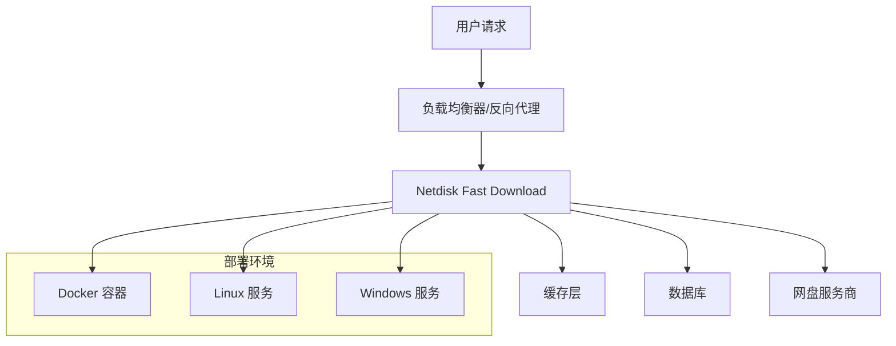

# 部署概览

Netdisk Fast Download 支持多种部署方式，适合不同的使用场景和技术栈。

## 部署方式对比

| 部署方式 | 难度 | 维护成本 | 适用场景 | 推荐指数 |
|---------|------|----------|----------|----------|
| [Docker 部署](/deployment/docker) | ⭐⭐ | ⭐⭐ | 生产环境 | ⭐⭐⭐⭐⭐ |
| [Linux 命令行](/deployment/linux) | ⭐⭐⭐ | ⭐⭐⭐ | VPS/云服务器 | ⭐⭐⭐⭐ |
| [宝塔面板](/deployment/baota) | ⭐ | ⭐⭐ | 新手友好 | ⭐⭐⭐⭐ |
| [Windows 服务](/deployment/windows) | ⭐⭐ | ⭐⭐⭐ | Windows 服务器 | ⭐⭐⭐ |

## 系统要求

### 最低配置
- **CPU**: 1核心
- **内存**: 1GB RAM
- **存储**: 5GB 可用空间
- **网络**: 100Mbps 带宽

### 推荐配置
- **CPU**: 2核心以上
- **内存**: 2GB RAM 以上
- **存储**: 10GB 可用空间
- **网络**: 1Gbps 带宽

### 软件要求
- **JDK**: 17 或以上版本
- **Node.js**: 18 或以上版本（构建时需要）
- **操作系统**: Linux/Windows/macOS

## 架构概览



## 网络架构建议

### 单机部署
```
Internet --> 防火墙 --> Nginx --> Netdisk Fast Download
```

### 集群部署
```
Internet --> CDN --> 负载均衡器 --> [多个实例] --> 共享缓存
```

## 安全配置

### 防火墙设置
```bash
# Ubuntu/Debian
sudo ufw allow 6400/tcp
sudo ufw enable

# CentOS/RHEL
sudo firewall-cmd --permanent --add-port=6400/tcp
sudo firewall-cmd --reload
```

### 反向代理
建议使用 Nginx 或 Caddy 作为反向代理：

1. **SSL/TLS 终止**
2. **请求限流**
3. **缓存控制**
4. **日志记录**

### 访问控制
```nginx
# Nginx 配置示例
location / {
    # IP 白名单
    allow 192.168.1.0/24;
    deny all;
    
    # 限制请求频率
    limit_req zone=api burst=10 nodelay;
    
    proxy_pass http://localhost:6400;
}
```

## 监控与日志

### 日志配置
应用日志位置：
- **Docker**: `/app/logs/`
- **Linux**: `./logs/`
- **Windows**: `logs\`

### 监控指标
建议监控以下指标：
- CPU 和内存使用率
- 请求响应时间
- 错误率
- 缓存命中率

### 健康检查
```bash
# 检查服务状态
curl http://localhost:6400/v2/statisticsInfo

# 预期返回
{
  "code": 200,
  "msg": "success",
  "success": true
}
```

## 性能调优

### JVM 参数优化
```bash
java -Xms512m -Xmx1024m \
     -XX:+UseG1GC \
     -XX:MaxGCPauseMillis=200 \
     -Djava.awt.headless=true \
     -jar netdisk-fast-download.jar
```

### 数据库优化
- 定期清理过期缓存
- 优化数据库连接池配置
- 使用 SSD 存储提升 I/O 性能

### 网络优化
- 启用 HTTP/2
- 配置适当的连接超时时间
- 使用 CDN 加速静态资源

## 备份策略

### 数据备份
```bash
# 备份脚本示例
#!/bin/bash
DATE=$(date +%Y%m%d_%H%M%S)
BACKUP_DIR="/backup/netdisk-$DATE"

mkdir -p $BACKUP_DIR
cp -r ./db $BACKUP_DIR/
cp -r ./resources $BACKUP_DIR/
cp -r ./logs $BACKUP_DIR/

# 压缩备份
tar -czf "$BACKUP_DIR.tar.gz" $BACKUP_DIR
rm -rf $BACKUP_DIR

# 保留最近7天的备份
find /backup -name "netdisk-*.tar.gz" -mtime +7 -delete
```

### 自动备份
```bash
# 添加到 crontab
0 2 * * * /path/to/backup.sh
```

## 故障恢复

### 快速恢复步骤
1. 检查服务状态
2. 查看错误日志
3. 重启服务
4. 恢复备份数据（如需要）

### 常见故障处理
```bash
# 检查端口占用
netstat -tulpn | grep 6400

# 检查磁盘空间
df -h

# 检查内存使用
free -h

# 检查日志错误
tail -f logs/app.log | grep ERROR
```

## 容量规划

### 并发处理能力
- 单核可处理约 100 并发请求
- 建议根据实际使用量进行压力测试

### 存储需求
- 数据库：约 1MB/万次请求
- 日志：约 10MB/天（中等使用量）
- 缓存：根据缓存时间和请求量计算

### 带宽需求
- 下行：主要用于返回解析结果
- 上行：与网盘服务商通信

## 选择部署方式

### Docker 部署 - 推荐
- ✅ 环境一致性好
- ✅ 部署简单
- ✅ 易于扩展
- ✅ 便于管理

### Linux 原生部署
- ✅ 性能最优
- ✅ 资源占用少
- ❌ 环境配置复杂
- ❌ 升级相对麻烦

### 宝塔面板部署
- ✅ 可视化管理
- ✅ 新手友好
- ✅ 集成度高
- ❌ 需要宝塔环境

### Windows 服务部署
- ✅ Windows 环境友好
- ✅ 服务化管理
- ❌ 性能相对较低
- ❌ 生产环境不推荐

根据你的实际情况选择合适的部署方式，推荐从 Docker 部署开始尝试。